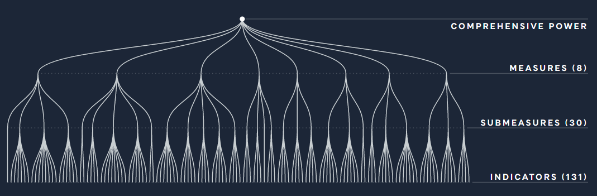
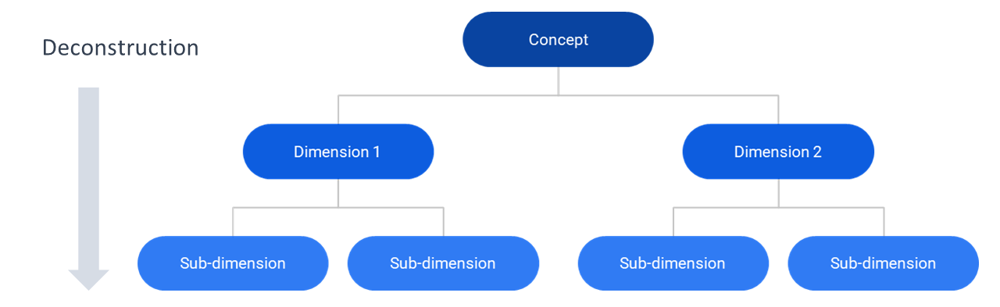
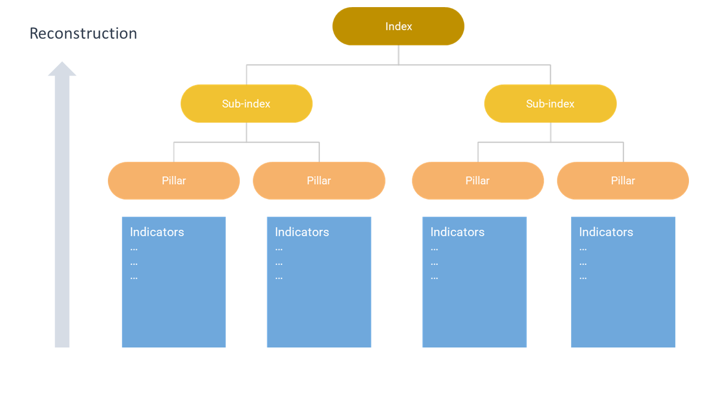

Building a conceptual framework is one of the first steps to take when
building a composite indicator or a scoreboard. This is not a trivial
task, but doesn’t need to be daunting.

## What

Let’s first clarify what a conceptual framework actually is. As we have
seen previously, composite indicators almost always target
multidimensional concepts. A conceptual framework is essentially a
mapping of your concept, identifying dimensions, sub-dimensions, and so
on.

To take an example, see the conceptual framework below of the Times
Higher Education World University Rankings.

In this framework, the developers identified five dimensions which
comprise in their opinion the “excellence” of a university: Teaching,
Research, Citations, International Outlook and Industry Income. Each of
the dimensions is populated with a group of indicators which aim to
represent that dimension. Notice that this framework has three levels –
the indicator level, the dimension level, and the index level (we will
discuss how indicators are used to calculate scores for higher levels
shortly).

Other indexes are more complex. The Lowy Institute Asia Power Index
framework, pictured below, is comprised of eight “measures” which are in
turn comprised of 30 “submeasures” and 131 underlying indicators. This
framework has four levels.

## Deconstruction

So how do we actually arrive at a conceptual framework? In theory (and
we’ll get to some practical issues in a moment) a conceptual framework
is a deconstruction of a multidimensional concept. The first step is to
understand as well as possible what the concept you are aiming to
measure actually means. This can be done by reviewing any existing
(academic) literature on the topic, by talking to experts on the topic
(e.g. in a workshop if possible) and surveying any existing indexes or
measurement frameworks that measure your concept or something similar to
it. If you are already an expert on your concept then this certainly
helps!

By doing this, some main components of your concept should become clear:
let’s call these dimensions . Now each dimension has to be carefully
examined – does it have clear sub-dimensions? If so, these can also be
added to your conceptual framework. The sub-dimensions themselves may
have sub-sub-dimensions, and so on.

But when to stop deconstructing? There are a few considerations. First,
we want each component of our lowest level of the framework to be
reasonably measurable with a (smallish) group of indicators. The whole
point of the deconstruction process is to break down our complex concept
into smaller measurable chunks.

Next, like many things in life there is a trade off between accuracy and
complexity. Perhaps having seven levels in your framework might be the
strictest representation of the concept, but it would probably be
bewildering to users! To the extent possible, try to aim for simplicity.

Last, consider that dimensions and sub-dimensions will themselves have
scores as a result of aggregating indicators. If you think users would
be interested in these scores, then this might be a good reason to keep
them. If users are perhaps not interested, maybe the concept does not
need to be so finely deconstructed.

The idea of deconstruction is a common technique in modelling a complex
system – finite element analysis, for example, allows structural
analysis of very complex engineering designs by breaking them into
smaller, more manageable elements. Generally, any analysis of a complex
system involves decomposing the complexity into simpler pieces.

## Reality strikes

So this all sounds fantastic, but in reality it is not that
straightforward! There are plenty of practical issues that get in the
way of your dream framework.

In the first place, it is not always so easy to get a clear and agreed
definition of what your concept actually means. In some cases there may
be a widely-accepted definition (e.g. “sustainable development” is
reasonably encapsulated by the UN’s Sustainable Development Goals), but
often this is not the case. Different sources will define the concept,
and its components, differently. Experts will often disagree. This is
simply a manifestation of the fact that complex concepts are, well,
complex. And complexity brings uncertainty.

A further problem is that even when the main components of a concept are
known, there may be different conceivable ways to group them, depending
on the functionality of the index. To take an example, a few years ago I
was working on the ASEM Sustainable Connectivity Indexes, which aim to
measure sustainable international connections between Asian and European
countries. We grappled for rather a long time with how to capture this:
should only sustainable forms of connectivity be included? What
comprises “sustainable” in this context? Social sustainability often
runs against environmental sustainability. At one point we considered a
framework of “Connectivity enablers” and “Connectivity outcomes”. In the
end, after many rounds of consultation with experts, we settled on a
simpler framework mapping the main components of connectivity, with a
separate “sustainability” index. The point here is that there were many
potential ways of decomposing the same concept!

Last, but absolutely not least, is the issue of data availability. While
we can certainly arrive at a “theoretical” conceptual framework using
the ideas above, if we want to actually populate this with indicators,
we will probably have to make adjustments. Quite often, data is lacking
for key components of the framework. There is little point including a
sub-dimension for which little or no data is available, and the final
conceptual framework of the index will almost always be shaped by which
indicators are practically available. That said, pointing to data gaps
can also be a useful strategy for spurring future data collection.

At the end of the day, the final framework will be a compromise between
what is theoretically desired, and what is practically possible.

## Reconstruction

Having picked the concept into tiny pieces, we can now put it back
together.

We begin with the lowest level in the framework (let’s call them
sub-dimensions). Each sub-dimension must be measured with a group of
indicators which offers a reasonable representation of that “chunk” of
our concept. The process of indicator selection is a tricky business
which will be dealt with in another post, but we’ll skip lightly over it
for the minute.

Using each group of indicators, we can build a composite indicator which
gives a measurement for each sub-dimension. In practice, this is done by
normalising indicators (bringing them onto a common scale) and then
aggregating them (usually by taking some form of weighted mean).

Now, our sub-dimension composite indicators can themselves be aggregated
to give higher-level composite indicators for each dimension. Finally,
the dimensions are aggregated to give the index.

## In summary

A conceptual framework is a map of our concept. This is usually a
hierarchical map, where dimensions are broken down into sub-dimensions,
and so on. As with many things, it is a trade off between various
considerations, including:

-   Accuracy – mapping the concept as thoroughly as possible
-   Simplicity – creating a map that is still interpretable by users and
    not overwhelming
-   Usability – the end result should include components that are
    actually of interest to users
-   Measurability – the components of our map should be measurable,
    otherwise they cannot be included in the index
-   Acceptability/credibility – the map should agree with expert opinion
    and established literature on the topic
