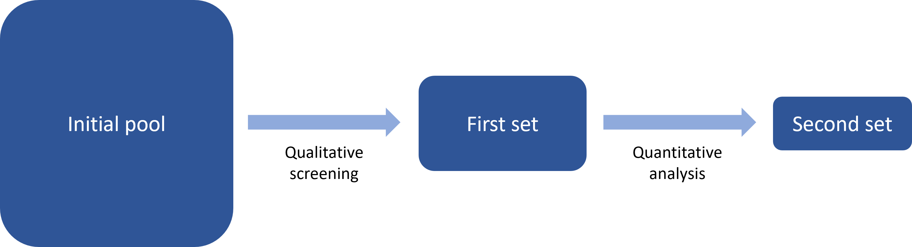

Recently we explored how to build a conceptual framework for a composite
indicator. Once you have a conceptual framework, the next step is to
populate it with indicators. It’s worth reiterating that these steps are
usually iterative, meaning that you may begin with a rough conceptual
framework, then begin identifying indicators, adjust the framework, move
back to indicator selection and so on. But with that said, let’s explore
the basics of indicator selection.

## Several stages

Most likely there are going to be at several rounds of selection. This
sounds complicated, but simply represents the reality of building an
indicator framework. I would suggest that indicator selection often
looks something like this:

Here, the “initial pool” is a wider set of possible indicators, for
which data has not yet necessarily been collected. This is first
narrowed down to a “First set” of indicators which are realistic and
satisfy basic qualitative properties. Then, after data collection, a
quantitative analysis can help to narrow down the set yet further to the
“Second set”. The sizes of the boxes are roughly meant to represent the
numbers of indicators at each stage.

Now we will examine each of these steps more carefully.

## Qualitative selection

Let’s say that we arrived at the point where we have mapped the concept
we want to measure, i.e. our conceptual framework is sketched out. The
next step is to think which indicators could be used to measure each
group at the lowest level of the framework. It is likely that in the
process of building the conceptual framework (e.g. via workshops,
literature review, talking to experts, etc.) you will have already
identified some potential indicators, and possibly have a list of
suggestions from experts and stakeholders (some realistic, other perhaps
less so). You may have also identified other indicators from looking at
other scoreboards and indexes.

This “longlist” of indicators represents the “Initial pool” in the
figure above. Note that at this stage, it is just a (potentially long)
list of possible indicators, and the serious data business of data
collection has not yet started. Why? Because collecting data can be
quite time-consuming, and we want to be sure that each indicator we set
out to collect data for is worth the effort.

For this reason, we can apply an initial set of qualitative indicator
criteria to our longlist, to narrow it down to the most useful
indicators. Here are a few criteria you might want to think about.

1.  **Relevance**: the indicator must be relevant to the concept we are
    measuring, and relevant to the specific chunk of the concept we are
    examining.
2.  **Availability**: we may not have acquired the data yet, but is the
    data out there somewhere? We should at least have an idea of
    where/how to acquire the data.
3.  **Cost of acquisition**: meaning cost in terms of time and money.
    Some indicators can be easily and quickly acquired through
    centralised databases (e.g. Eurostat, World Bank). Others can be
    either very time-consuming to acquire (e.g. involving surveys or
    complex web-scraping) or expensive (buying proprietary data sets
    from private companies), or both!
4.  **Reliability**: is the data from a trusted source?
5.  **Value added**: indicators should each bring some unique
    information to the framework, and overlaps should be minimised.
6.  **Interpretability**: it should be clear what the indicator is
    measuring, so that it is useful to end users on its own, as well as
    part of a framework
7.  **Sustainability**: assuming the indicator framework will be updated
    in the future, how likely is it that the indicator source will still
    be available?

It is worth assessing the pool of indicators against these criteria, to
help pick out the most suitable ones to take forward to the next step.
Keep a record of the selection so you can show why indicators were
discarded (stakeholders/experts will commonly ask why their suggested
indicators were not included when they see the finished product).

## Quantitative selection

We have now arrived at the “First set” as shown in the flow chart above.
At this point, data has to be collected for each indicator. This process
could take rather a long time, and much could be said about that, but
let’s fast forward to the point where you have data for each indicator.
What’s next?

At this point we can perform a quantitative analysis and further screen
the indicators based on another set of criteria, which are suggested as
follows.

1.  **Data availability**: almost always, indicators will have missing
    data for some units. Ideally, we want as few missing data points as
    possible (with respect to the set of units we wish to compare).

2.  **Timeliness**: how recent is the most recent data point? We clearly
    prefer the most up-to-date data.

3.  **Frequency**: how often is the data updated? Be careful with
    indicators that may only be updated every 2 years or more.

4.  **Time series length**: this is linked to data availability. If you
    wish to measure your concept over time, longer time series are
    preferable because they allow more detailed time series analysis.

5.  **Granularity**: even if you are creating an index at the national
    level, for example, indicators with sub-national data (e.g. regional
    or city data) can give interesting extra possibilities for analysis.

6.  **Differentiation**: indicators should be able to differentiate
    between countries/units. If the indicator has the same or very
    similar values for all or most units, it is not very useful in
    making comparisons.

7.  **Correlations**: can help to identify relationships between
    indicators, including unexpected negative correlations,
    collinearity, and others. See our blog post on this topic.

8.  **Metadata**: apart from the data availability, the presence of
    metadata should be taken into account. For example, if targets are
    required, are they available? Is the source of the data available
    and the methodology transparent? And so on.

Interestingly, data availability is relative to the set of units you
want to measure. For example, if you aim to have an index value for each
country worldwide, data availability is the percentage of countries for
which your indicator has a measured value. However, before discarding
indicators it may be worth a different approach: discarding units
(countries). Many indexes target a more modest set of countries, e.g.
100-150 or so, for which data is available for most indicators. This
brings up the data availability score for each indicator. Excluded
countries can still be reported on using the few available indicators,
but without generating aggregate scores.

## Other considerations

As mentioned, indicator selection is an iterative process. The important
thing is to keep a record of what you did and why each indicator was
discarded or retained.

Selection criteria should not be applied too rigidly and make room for
special cases and considerations. For example, depending on the context,
some indicators with possibly low data availability may be politically
highly relevant, and discarding them could cause communication issues
for the framework. We may also find two indicators that are highly
correlated: however, although this may not be ideal in building the
index, they may both have added value as individual indicators,
recalling that we should always present the indicator data along with
the index for users to explore.

There may be other context-dependent criteria. For example, if the
objective of the indicator framework is to monitor the progress or
performance of e.g. a policy or intervention, you may need to also
consider whether indicators are inputs, outputs, outcomes etc. This is
also another topic for another blog post!

## Concluding

This has been a short tour into indicator selection. Often, the
selection of indicators is going to boil down mostly to what is relevant
and what is available. However, we should be very careful to examine the
remaining set of indicators with a critical eye.

It is not uncommon that there will be important gaps in the framework
simply because no data (or perhaps very little) is available for a
desired indicator. This should be highlighted and can help to encourage
future efforts to collect the important data.

Equally, when drawing conclusions with our final set of indicators and
the index, keep in mind that the index will inevitably have gaps, and
these gaps do affect the results.
