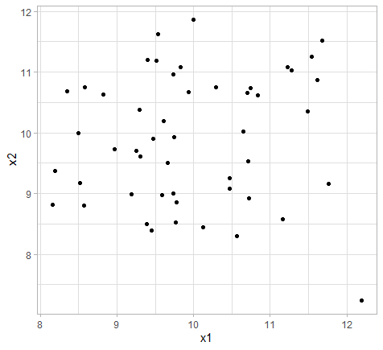
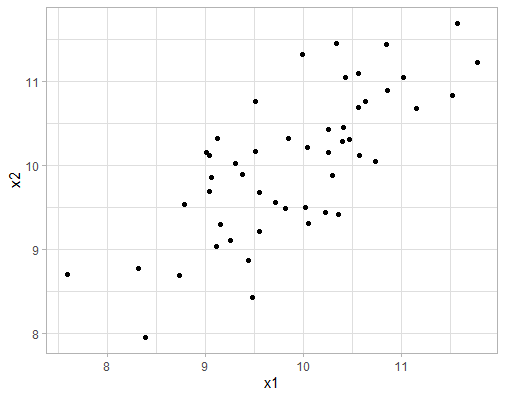

Let’s dig in to one of the thorniest topics in composite indicators:
dependence, correlations and the definition of “indicator importance”.
Take a deep breath. Ready?

## The big squeeze 🍋

Before talking about correlations and more technical things, we need to
clarify what exactly we are aiming to do here, and why. Recall that a
composite indicator is an aggregation of a set of indicators (possibly
with intermediate aggregation steps) into a single composite measure:
the composite indicator.

You don’t need to know much about composite indicators to understand a
fundamental issue here: by combining many indicators into one, we are
compressing the information of many variables into a single measure, and
in doing so, there is inevitably a loss of information.

To give a very simple example, let’s say we have two indicators
measuring two different but related things about a country . The
indicator values (after normalisation/scaling) are 8 and 12. To get our
composite indicator score, we take the arithmetic mean with equal
weights, and this gives a score of 10.

Now let’s pretend that we don’t know what the indicator values are, but
only the composite score. Can we work out what the indicator values are,
from the aggregate score of 10? No, of course not, because the score of
10 could be from any of an infinite number of indicator values that
happen to have an average value of 10. This is a long and roundabout way
of saying that by aggregating, we have lost some information, and this
is an irreversible process – although we can calculate the aggregate
value from the indicator scores, we can’t calculate indicator scores
from the aggregate value.

This loss of information is a concern in building a composite indicator,
because one of the main aims should be to build a good summary measure
of the underlying indicators.

## Correlations and complications 🤯

Actually, the picture is slightly more complicated than the previous
section implied, and this is because we almost never build a composite
indicator for a single country – normally we would have set of
countries. This means that each indicator has a distribution, and there
can exist correlations between indicator distributions. Correlations are
one of the main tools of analysis in composite indicator construction
and auditing. Let’s explore this concept further.

We continue the trivial example in the previous section where we build a
(rather scant) composite indicator out of two indicators (call them x1
and x2). But here we make it slightly more realistic by assuming that we
have 50 countries. Further, we’ll assume that both indicators are
independent (uncorrelated with one another) and have normal
distributions. If we plot one against the other, it looks like this:

The fairly shapeless data cloud here should illustrate that the
indicators are indeed independent. Now we aggregate our two indicators
into the composite indicator. Again, we’ll use equal weights, so this is
just taking the mean of each pair of values. This results in a composite
score for each of the 50 countries. We will now plot the composite
indicator (call it y) against each of the underlying indicators in turn.

Notice that y, the composite, is correlated with both of the underlying
indicators. Now, let’s re-pose the question from the first section: if
we don’t know the underlying indicator values, but we know the composite
score of 10, can we work out the underlying indicator values?

The answer is now slightly different. We can’t know for sure what the
underlying values are, but we can guess. Looking at the plots above, if
y = 10 we could guess that x1 is probably between about 9 and 11, and x2
is somewhere between 8.5 and 11. We could work this out more accurately
by using a conditional mean, but the point is here that we can know
something about the underlying indicators by knowing the composite
score, because the composite is correlated with its indicators.

This now relates back to our aim that the composite should be a good
summary of its underlying indicators: the better we are able to guess
the indicator values from the composite, the more effective a summary it
is.

Let’s now take a second example where the two indicators are correlated
*with one another*. Plotting one indicator against the other now looks
like this:

This shows that the two indicators are quite strongly related with one
another. We’ll now aggregate these indicators (again using the mean) and
plot the composite against each indicator as we did previously.

It should be evident that the correlation between each indicator and the
composite is here stronger than the previous example (in which the
indicators were uncorrelated with each other). This demonstrates a basic
property – the more that indicators are correlated with each other, the
more the composite indicator is correlated with its underlying
indicators.

Moreover, if we again try to guess the indicator values, knowing that
the composite score is 10, we see another thing: because the
correlations between composite and indicators are stronger, our guess
about the indicator values will be more precise. We could guess, for
example, that both x1 and x2 lie between about 9.5 and 10.5: these
ranges are narrower than in the previous case where indicators were
uncorrelated with each other. The implication is that the composite
indicator is now a better summary of its underlying indicators.

This is a lot to digest so let’s summarise before going any further.

1.  When we aggregate indicators into a composite indicator, we
    naturally lose information.

2.  But, we would like a composite indicator to summarise its underlying
    indicators as well as possible, i.e. we prefer to lose as little
    information as possible.

3.  One way of framing this loss of information is: if we know the
    composite score, how well can we guess the underlying indicators?

4.  Because of correlations between the composite indicator and its
    underlying indicators, we can make a guess at underlying indicator
    values, given just the composite scores.

5.  The more that indicators are correlated with one another, the more
    accurately we can guess underlying indicator values from the
    composite scores.

6.  By extension, the more that indicators are correlated with one
    another, the less information is lost when aggregating.

This last point is the crux. If we want to lose as little information as
possible, then indicators should be well-correlated with one another
(resulting in good correlations between indicators and composite).

There is an intuitive explanation behind this. You can imagine a
correlation between two indicators as an overlap of information: the
higher the correlation, the more the information overlaps. Or in other
words, if the higher the correlation, the less information is unique to
each of the two indicators.

The figure above should help to clarify: the total information of the
two indicators can be thought of as the total area of the ovals. When
the ovals are independent, the total area is greater than when they are
correlated (overlapping). This means that in the independent case, there
is simply more information to compress into the composite, so naturally,
since we can only fit a limited amount of information into a single
number, the information loss is greater on aggregation. In the opposite
case, if two indicators are perfectly correlated, there is no loss of
information at all when we aggregate.

## Number of indicators

If you made it this far, there’s another complication waiting for you.
In the previous section we just looked at a pair of indicators, with one
single correlation value. What happens in the more realistic case when
we have more indicators?

This is intuitively explained again by the ovals. Imagine we add a third
indicator (oval) to the picture, it is not difficult to see that the
total area, i.e. the total amount of information, is increased. And if
we aggregate this into a composite we will naturally lose more
information than if we only had two indicators.

The implication here then, is that a greater proportion of information
is retained when we have:

-   Fewer indicators, and

-   Stronger correlations between indicators

And vice versa, of course. We can in fact explore this with a little
simulation. Let us use the average squared correlation (R squared)
between the composite indicator and each of its underlying indicators as
a measure of the proportion of information transferred. When we vary
both the number of the indicators and the correlations between
indicators, here is what we get:

This confirms the points above. But the interesting thing is that for a
given average correlation, if we keep adding indicators the average
R-squared (the “representativeness” of our composite indicator) does not
decrease to zero as might be expected. In fact, it tends to a limit,
which is the average correlation between the indicators. This means that
larger indicator frameworks can still yield a composite indicator with a
reasonable degree of representativeness, so long as the correlations
between indicators are reasonably high.

All of this can actually be proved and is related to information theory.
If you want to dig into that (or find a citation for the concepts I have
explained here), see [this
paper](https://doi.org/10.1016/j.envsoft.2021.105208).

## High correlations = good?

All this might lead you to believe that indicators should be as
highly-correlated as possible, in order to have a super-representative
composite indicator; and independent or (horror of horrors)
negatively-correlated indicators should be avoided at all costs. In
reality the picture is more nuanced.

First of all, the number of indicators is important. From the figure
above, you could aggregate two independent indicators and still achieve
about the same degree of representativeness as a larger number of
indicators with average correlation 0.4, for example. So, as long as the
number of indicators is small, you can get away with weakly-correlated
indicators in this respect.

The second point is that conceptually, it may be more efficient to have
two completely uncorrelated indicators that bring completely different
information to the framework, than a larger bunch of indicators that
overlap to a large degree. Independent indicators have a higher *added
value*. At the other end of the spectrum, if we have indicators that are
very highly correlated, we are basically double-counting, and the added
value is effectively zero.

Often, a moderate level of correlation between indicators is recommended
as a target, with correlations ranging from e.g. 0.4 to 0.8. This is of
course a rule of thumb. Moreover, in practice this is quite hard to
achieve.

## Correlation = importance?

This is a tangential issue but worth mentioning. Correlation between
indicators and the composite is sometimes used as a measure of the
“importance” of the indicator in the framework. The logic is that, if an
indicator has a strong correlation with the composite, it is driving the
composite indicator, whereas an indicator with a poor correlation is
“silent” and therefore less important.

In my view this is not quite correct. In the first place, a composite
indicator is demonstrably a function of its underlying indicators, so
each indicator is definitely contributing to the overall score.

Second, we could think of an alternative definition of importance for a
given indicator: what would be the impact on the composite scores if we
remove it from the framework? One might be tempted to think that the
poorly-correlated “silent” indicators would have little or no impact. In
fact, it is usually these indicators that have the most impact when
removed. This is because usually such indicators are weakly correlated
with other indicators, which means that they have a *greater unique
contribution of information*. Viewed this way, it is easy to see that
when removed, they have a greater impact because we are taking a bigger
chunk of information out of the framework.

It seems safer to view correlation in terms of information. The best way
I can put is that correlations between indicators and the composite show
the degree to which information is shared between them.

## Back to reality

Correlations are just one of many considerations in building a composite
indicator, so it is important to view them as an analytical tool like
any other, and not get too hung up on them. Equally, they shouldn’t be
disregarded. Unsurprisingly, it requires a degree of balance and
judgement.

The fact is that indicator frameworks are often more dominated by
conceptual choices than correlations. Whereas we would love to have
perfect correlations, in practice an indicator may be crucial to a
framework even if it is uncorrelated, and we may need a fairly large
number of indicators to fully cover our concept, and to capture the
viewpoints of stakeholders. It is not uncommon for negative correlations
to appear, as well as fiendishly-skewed and unusually-shaped
distributions, for which linear correlations are not even a good summary
measure.

At such times we should remember that composite indicator should only be
used as a summary and an entry point to its underlying indicators. In
this context, as long as we give sufficient visibility and importance to
the underlying indicators, and things are carefully presented and
communicated, a composite indicator composed of poorly-correlated
indicators might not be a serious problem in practice. We could also
choose not to fully aggregate the composite indicator and to leave it
e.g. at the sub-index level to alleviate the problem.

Let’s summarise the summary:

-   The average correlations between indicators are related to the
    “representativeness” of the composite indicator: how well it
    represents its underlying indicators.

-   More indicators means a smaller proportion of information
    transferred to the composite, but this tends to a limit.

-   A very vague rule of thumb is to have correlations between
    indicators of about 0.4-0.8 (higher correlations imply little added
    value of indicators).

-   These considerations are important but should be balanced with
    conceptual issues, and kept in the context of how the composite
    indicator is actually used and communicated.

If you made it this far, well done, you deserve a rest, as do I. Thanks
for reading!
